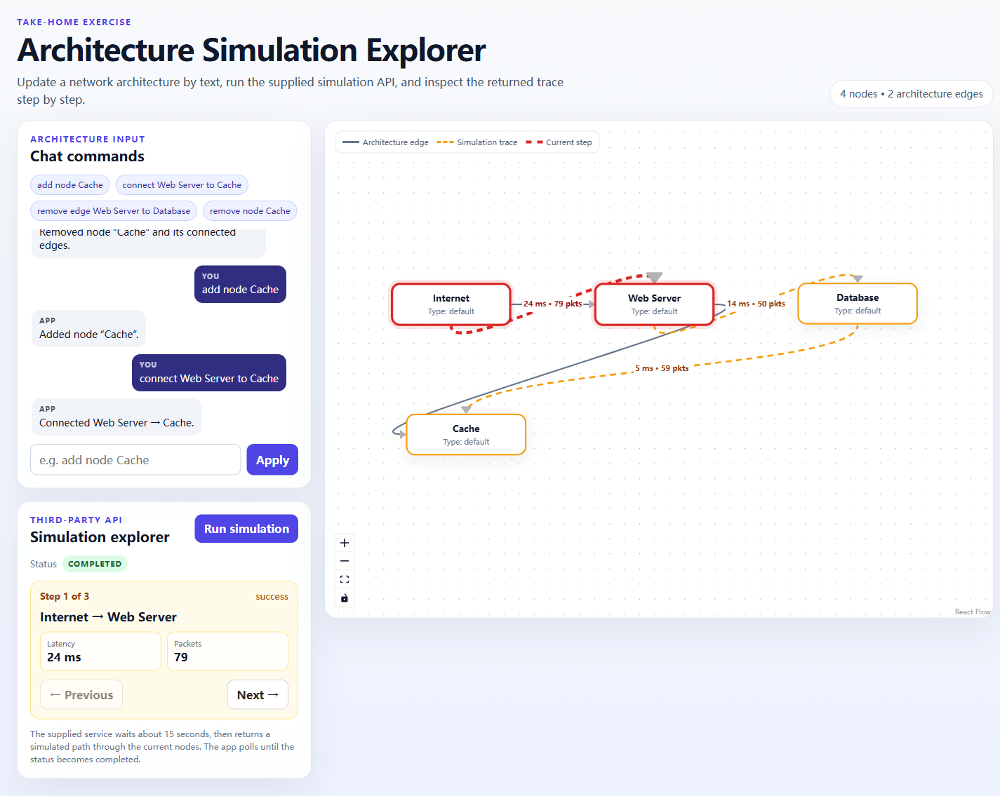

# Architecture Simulation Explorer

Architecture Simulation Explorer is a React + TypeScript take-home project for editing a small network architecture with text commands, running the supplied asynchronous FastAPI simulation service, and stepping through its returned trace in React Flow.

The canvas keeps architecture state (labels, positions, and architecture edges) separate from the simulation response. The API receives only the current node IDs and types, so the returned simulation trace is rendered as a separate overlay.

## Submission evidence

- [65-second demo recording](docs/demo.webm)
- [Completed simulation screenshot](docs/simulation-completed.png)
- [Requirement checklist and verification results](VERIFICATION.md)

The recording shows the command flow, a real run against the supplied service, the loading state while the service is working, and the completed trace. The screenshot is a post-run view for reviewing the completed result and the surrounding command history.



## Prerequisites

- Node.js **22.18 or newer**
- Python **3.10 or newer**
- npm

The Node version is declared in `package.json`. The Python service uses the supplied `simulation_service.py` and needs FastAPI and Uvicorn.

## Run locally

Run these commands from the project folder in two terminals.

Terminal 1 — start the supplied simulation service:

```bash
python -m pip install fastapi uvicorn
python -m uvicorn simulation_service:app --reload --host 127.0.0.1 --port 8000
```

The service runs at `http://127.0.0.1:8000`; its interactive API documentation is at `http://127.0.0.1:8000/docs`.

Terminal 2 — install and start the frontend:

```bash
npm install
npm run dev
```

Open the URL printed by Vite, normally `http://localhost:5173`.

The local Vite proxy forwards `/api/*` to `http://127.0.0.1:8000` for local development and preview. A production deployment needs a reverse proxy or same-origin API route for `/api/*`; the Vite development proxy is not a production backend.

## Verify and build

```bash
npm test
npm run build
npm run preview
```

Run `npm run preview` after `npm run build` to inspect the built frontend locally. Keep the supplied Python service running while using the preview so simulation requests can reach the API.

Do not include `node_modules/`, a Python virtual environment, or generated `dist/` output in the submission archive.

## Text commands

The parser is deterministic and does not call an LLM. Commands and node labels are matched case-insensitively. Leading/trailing whitespace and repeated spaces are normalized, and labels containing spaces may be wrapped in single or double quotes. Node labels are capped at 80 characters.

Quote an endpoint if its label contains a command separator, for example `connect "Route to Cache" to Database`. Edges are directed; disconnecting A → B does not remove B → A. Invalid or empty commands produce a message in the history without changing the graph.

| Command | Expected behavior |
| --- | --- |
| `add node <label>`<br>`create node <label>` | Add a node at the next available layout position. Duplicate labels are rejected. |
| `connect <source> to <target>`<br>`connect <source> -> <target>`<br>`add edge <source> to <target>` | Add an architecture edge between two existing, different nodes. Missing, self, or duplicate edges are rejected. |
| `remove node <label>`<br>`delete node <label>` | Remove the node and every architecture edge attached to it. |
| `remove edge <source> to <target>`<br>`disconnect <source> from <target>`<br>`delete edge <source> -> <target>` | Remove the matching architecture edge. Both nodes and the edge must exist. |

Examples:

```text
add node Cache
connect Web Server to Cache
disconnect Web Server from Database
remove node Cache
add node "API Gateway"
```

Nodes remain draggable on the canvas. Direct drag-to-connect and keyboard deletion are deliberately disabled; topology changes go through the commands above so the command history and validation stay consistent.

## Simulation behavior

The frontend sends the current nodes as:

```json
{
  "nodes": [
    { "id": "node_web_server", "type": "default" }
  ]
}
```

Labels, positions, and architecture edges stay in the frontend state and are not sent to the service. React Flow nodes in this app use the `default` type, while the request maps a missing type to `null`.

The supplied service exposes:

| Endpoint | Behavior |
| --- | --- |
| `GET /health` | Returns `{ "status": "ok" }`. |
| `POST /simulate` | Accepts the node list and returns HTTP `202` with a `simulation_id` and `queued` status. |
| `GET /simulate/{simulation_id}` | Returns `queued`, `running`, or `completed`; completed responses include trace edges with latency, packet count, and status. |

The app polls once per second and stops when the service reports `completed`, or after a 45-second deadline that also covers a request that hangs. The service intentionally takes about 15 seconds to finish. An accepted backend job continues in the service if the frontend stops watching it.

While a run is active, the simulation panel shows a loading UI with a spinner, the current service stage (`Sending request`, `Queued`, `Running simulation`, or `Waiting for result`), elapsed seconds, and an indeterminate progress bar. The API exposes lifecycle statuses but no numeric percentage, so the UI does not invent a percentage. After completion, the loading UI gives way to the trace step card. The command history keeps its own responsive, scrollable viewport with a stable height; additional simulation content expands the page below it instead of squeezing the chat area.

Editing the topology clears the old trace and aborts the frontend's active polling run. Unmounting the app also aborts the frontend request. These actions do not cancel the already accepted in-memory backend job.

Architecture edges and simulation trace edges are rendered separately. The trace uses an animated dashed overlay; `Previous` and `Next` select a trace step, highlight its source and target nodes and edge, and show its latency, packet count, and status.

The service creates its own path through the submitted nodes and may shuffle intermediate nodes. A returned connection need not exist in the architecture; it is still displayed and never saved as an architecture edge. One node completes with an empty trace. With no nodes, the Run button is disabled. HTTP, network, invalid-response, and timeout failures show an error and allow retry.

## Scope and design decisions

- Architecture edits and chat history are in memory and reset on refresh. The simulation service also stores jobs in memory.
- There is no authentication layer.
- There is no LLM integration because the assignment explicitly does not require one; regular expressions keep command behavior predictable and testable.
- The supplied backend is treated as an external service and is not modified by the frontend.

## Bonus evidence

- **Chat history:** user commands and app responses are retained in the in-memory log and remain visible while the simulation result is displayed. See [`ChatPanel.tsx`](src/components/ChatPanel.tsx). History resets on refresh.
- **Flexible wording:** the deterministic parser accepts the documented add/create, remove/delete, connect/disconnect variants, case-insensitive labels, repeated whitespace, and quoted labels with spaces. See [`commandParser.ts`](src/lib/commandParser.ts).
- **Input validation:** duplicate nodes, missing nodes, self-connections, duplicate edges, missing edges, empty commands, and malformed commands are rejected without mutating the architecture. Parser coverage is in [`commandParser.test.mjs`](tests/commandParser.test.mjs).
- **Helpful errors and recovery:** malformed commands return format guidance; API, network, invalid-response, and timeout failures are surfaced in the panel and leave **Run simulation** available for a retry. API polling and failure handling are covered in [`simulationApi.test.mjs`](tests/simulationApi.test.mjs).

React Flow type references: [Node](https://reactflow.dev/api-reference/types/node) and [Edge](https://reactflow.dev/api-reference/types/edge).
